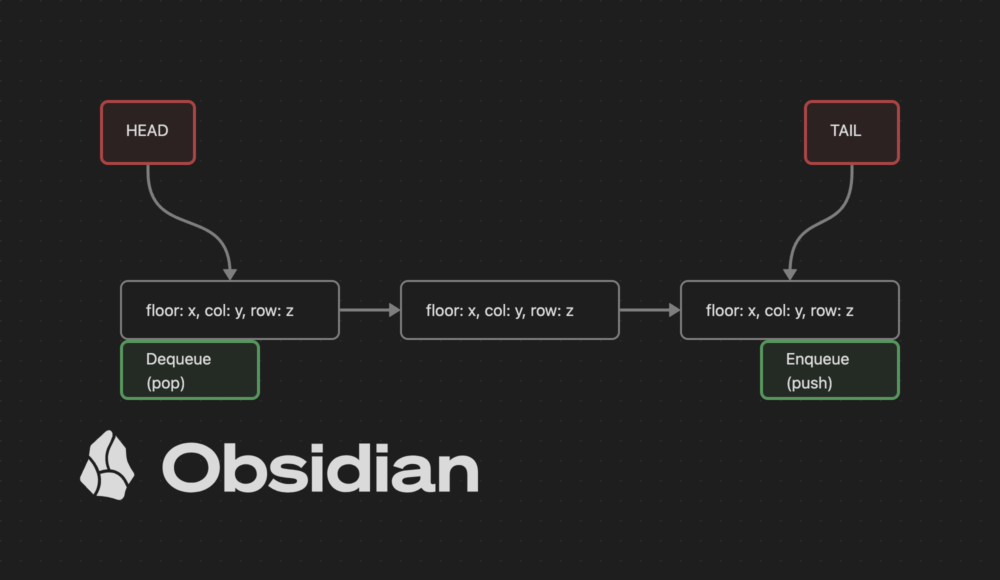
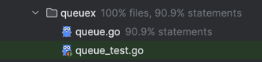
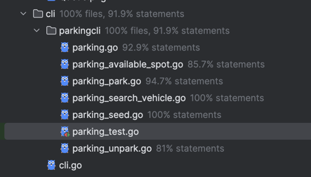
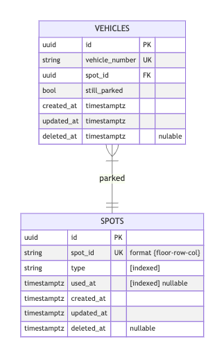
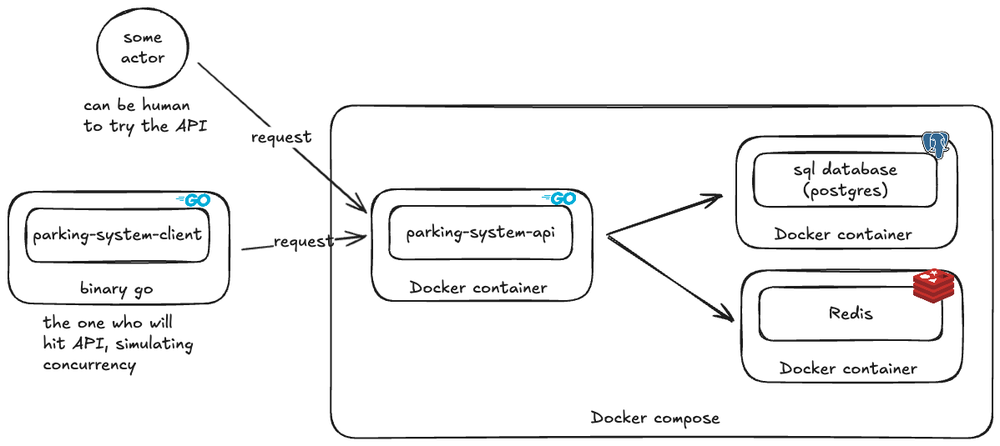

<br/>
<div align="center">
    
    <h1>Take Home Test - LLD01 - Parking System</h1>
</div>

## Details
This is a take home test for the DoiT recruitment process. The goal is to design a parking system that can handle various types of vehicles and parking slots, also make sure it safe to run concurrently.

notes:
**The parking lot has multiple gates, ensure the code is thread-safe for concurrent access.**

[Detail Requirement](./requirement/Take_home_assignment_-_LLD01.pdf)

### notes

#### why i'm focus on CLI
The purpose of this test is to assess my Go knowledge. While I usually focus on building APIs, I understand that making a system scalable often depends on supporting tools like databases and Redis, especially when it comes to handling race conditions and concurrency.

i knew in requirement the threshold is start from 1, but i will start from 0, to make it easier to handle the index, so the parking spot will be defined as `floors`, `row`, `column` starting from 0.
Then, for better readability, it can be easily add 1 each `floor`, `row`, `column` to display it to user.

and also i'm planning to make the API version, i will put the blue print on this documentation, i'm not sure i have time to do it because still have works to do.

## How i design it
There is some key points for this test:
1. multiple floors and parking spots defined as `floors`, `row`, `column`.
2. there is 3 types:
   - `B-1` for bike, 
   - `M-1` for motorcycle, 
   - `A-1` for car.

3. each parking spot only can hold one vehicle types. for example, parking spots in floor 1, row 1, column 1 can only hold `M-1` type vehicle. so it cannot be use by different vehicle types.
4. there is some parking spots cannot be used, for example, parking spots in floor 1, row 1, column 2 cannot be used, will be defined as `X-0` type
5. the parking system can handle multiple gates, so it can be used by multiple users at the same time.
6. there are 4 features:
    - `park(vehicleType, vehicleNumber)` method to park a vehicle
    - `unpark(spotId, vehicleNumber)` method to unpark a vehicle
    - `availableSpot(vehicleType)` get available parking spot for a vehicle type
    - `searchVehicle(vehicleNumber)` search a vehicle and get last `spotID`

### Data Seeding
there is no data sample on the requirement, so i create a data seeding using randomize spots.
[`cli/parkingcli/parking_seed.go`](./cli/parkingcli/parking_seed.go)
- it will create 3 dimensions slices
- each slice will be filled with randomize parking spots vehicle type
- every filled parking spots **except** `X-0` will be enqueue to `available spots` queue

### handle concurrency and fast to get spotID when parking
i'm using queue to handle available spots to do fast `parking` to get spotID then removing it from available spots, 
and fast `unparking` means when spot not used, directly add it back to available spots.

for the `thread-safety` means to handle `race-condition` i'm using `sync.RWMutex` to handle multiple read and write at the same time to the parking system.

this queue will be using `FIFO`, so the first available spot will be used first. and the spot after `unpark` will be get inserted back to the queue (`tail`).



also to verify this, i create a test to simulate multiple `enqueue` and `dequeue` at the same time using `go routine`. 
[(pkg/queuex/queue_test.go) `TestQueuexConcurrency(t *testing.T)`](./pkg/queuex/queue_test.go)
at the end of the test, it will check:
- remaining: `size of queue` after process
- dequeuedItems: total of `dequeue (pop)` items after process
- enqueuedItems: total of `enqueue (push)` items after process
- totalProcessed: total of `dequeuedItems + remaining` should be `same` with `enqueuedItems`
- validate the `items inside queue` same with `remaining`

### Parking stuff
from the requirement you need to:
- `record` the vehicle number and spotID when parking we need to save another data, so we use `map` for easier to find (will be use in `searchVehicle`). With this map, we can easily and fast to find the spotID by vehicle number.
- `availableSpaces` we need to store `queue` for each vehicle type, so we can easily get the available spot for each vehicle type.
- `spaces` to hold generated `seed` data. (it can be remove later, if the system will never show all detailed parking spots)

i create an interface [`ParkingSystem`](./parking/parking.go) to define the methods that need to be implemented, and then create a struct `parking` that implements the interface.
the goal is we can implement both for `API` and `CLI`. 

then to implement for `CLI`, we create a package [`parkingcli`](./cli/parkingcli) that will use the `parking` struct to handle the parking system.
to verify this i create the [`unit test`](./cli/parkingcli/parking_test.go) to test the `CLI` parking system.


#### unit test parking CLI
here i create embedded interface called `parkingForDebug` to add ability to access for `debug and verify` purpose`:
1. `GetSpaces()`: to get detailed parking spots
2. `GetAvailableSpaces()`: to get available parking spots each vehicle type
3. `GetParkedVehicles()`: to get parked vehicles map

all the test cover the requirement and the edge cases

## How To run
- go version `1.24`

install dependencies with
```bash
go mod tidy
```
### running test
you can run the test using `go test -race -v ./...` command.

### running simulation
I'm a bit confused about how to simulate concurrency in a CLI program that requires user input. Since real-time user input makes concurrency simulation difficult, I decided to create a simulation instead.

you can run with
```bash
go run main.go cli:simulate
```

or you can use docker to run the simulation
```bash
docker build -t doit-parking-system:0.1 .
docker run --rm doit-parking-system:0.1 cli:simulate
```
and you can customize the simulation by passing some arguments [flags]
- `--floors=8` to set the number of floors (default: 8)
- `--rows=1000` to set the number of rows (default: 1000)
- `--columns=1000` to set the number of columns (default: 1000)
- `--duration=15s` to set the duration of the simulation (default: 15s)
- `--gates=10` to set the number of gates (default: 10) <- how many concurrency
## Test Coverage
### queuex

### parking cli



## API Blueprint
Here i will try to describe what i'm going to do to implement the API version of the parking system.
### API Endpoints
- `POST /parking/park`: to park a vehicle
  - Request body: 
    ```json
    {
      "vehicle_type": "B-1",
      "vehicle_number": "1234"
    }
    ```
  - Response: 
    ```json
    {
      "data": {
        "spot_id": "1-2-10"
      },
      "message": "created"
    }
    ```
- `POST /parking/unpark`: to unpark a vehicle
  - Request body: 
    ```json
    {
      "spot_id": "1-2-10",
      "vehicle_number": "1234"
    }
    ```
  - Response: 
    ```json
    {
      "data": {
        "spot_id": "1-2-10"
      },
      "message": "ok"
    }
    ```
- `GET /parking`: to get available parking spots for a vehicle type
  - Query parameter: `vehicle_type`
  - Response: 
    ```json
    {
      "data": {
        "available_spots": [
          "1-2-10",
          "1-2-11"
        ],
        "total": 2
      },
      "message": "ok"
    }
    ```
- `GET /parking/search-vehicle`: to search a vehicle by vehicle number
  - Query parameter: `vehicle_number`
  - Response: 
    ```json
    {
      "data": {
        "spot_id": "1-2-10",
        "still_parked": false
      },
      "message": "ok"
    }
    ```
    
### ERD


so in the requirement, we don't need history of vehicles parking spot, the only we need is last parking spot.

### Architecture Diagram and simulating


we are not creating fancy stuff here, just the component to make the simulation works, such as
- API
- postgreSQL: as database
- Redis: as lock to handle concurrency
- Client API: this one will be used to simulate the parking system, it will send request to the API to park and unpark the vehicle.

all the stuff will be `containerized` and will be composed using `docker-compose`.
so this will be using redis as distributed locking, so if we want to add replica to the `API` we can easily do that!

### TODO
- [ ] Create pkg to connect to postgreSQL using [sqlx](https://github.com/jmoiron/sqlx)
- [ ] Create pkg to connect to Redis as distributed locking using [redsync](https://github.com/go-redsync/redsync)
- [ ] Create migration databsse using [goose](https://github.com/pressly/goose)
- [ ] Implement the API version of the parking system the router will be using [echo](https://echo.labstack.com/docs/quick-start)
- [ ] Create client API to simulate the parking system to hit multiple request at the same time
- [ ] Create dockerfile and docker-compose to run the API, postgreSQL, and Redis